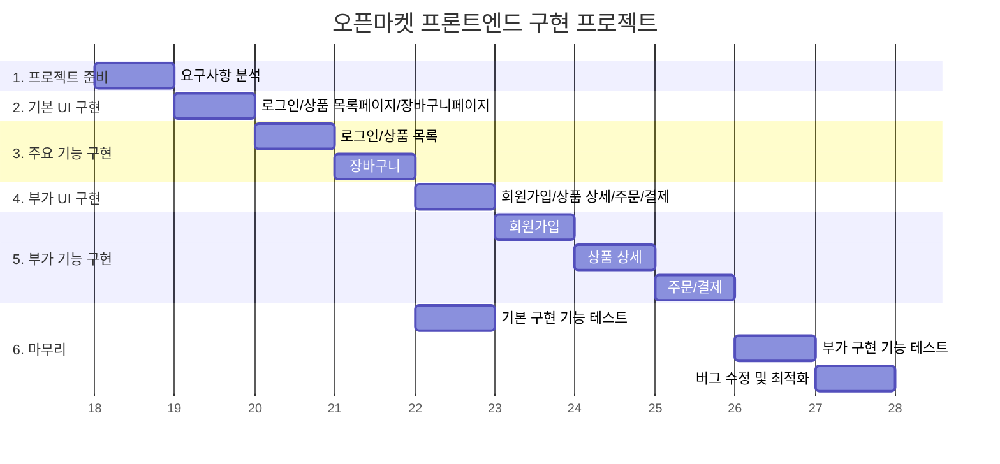

# openMarket

ESTsoft 부트캠프 개인 프로젝트 - 오픈마켓 구현

## 목표와 기능

### 1. 필수 구현 목표

- 구매자는 상품을 구매할 수 있습니다.
  - 상품의 세부사항을 확인할 수 있음
  - 장바구니에 넣을수 있고
  - 구매가 가능합니다.

### 1-2 기능

    a. 로그인 페이지
        - 아이디, 비밀번호가 일치하지 않거나 입력하지 않은채 로그인 버튼을 누르면 경고 문구가 나타납니다.
        - 입력 창 아래에 경고 메세지가  나타나면 로그인 버튼을 눌러도 로그인되지 않습니다.
        - 입력이 안된 채로 로그인 버튼을 누르면 입력되지 않은 창에 focus 이벤트가 작동하고 로그인은 되지 않습니다.
        - 아이디나 비밀번호가 일치하지 않느다면, 비밀번호 입력창에 focus 이벤트가 발생하고 빈칸이 됩니다.
        - 로그인 성공 시, 로그인하기 이전 페이지로 이동합니다.
        - 구매자, 판매자 회원 로그인 탭이 따로 있습니다.

    c. 상품 목록 페이지
        - 목록에서 상품을 클릭하면 상품 상세 페이지로 이동합니다.
        - 상품에는 상품 판매자, 상품명, 가격이 보입니다.

    e. 장바구니 페이지
        - `+`나 `-` 버튼을 누르면 수량 수정을 위한 모달창이 나타납니다.
        - 역시 재고 수량을 초과하면 `+` 버튼이 비활성화 됩니다.
        - 선택된 상품의 금액과 할인, 배송비가 적용되어 총 결제할 금액을 확인 할 수 있습니다.
        - 상품의 `x` 버튼을 누를 시 상품 삭제를 확인하는 모달창이 중앙에 나타납니다.
        - 모달의 확인 버튼을 누르면 상품이 장바구니에서 삭제됩니다.
        - 이미 장바구니에 넣은 제품을 다시 넣는 경우, 이전 수량과 합쳐집니다.
          * 합쳐진 수량이 제품의 재고보다 많을 경우 재고 수량이 초과 되었다는 모달창이 나타납니다.

    f. GNB
        - 상단 검색창은 ui로만 존재합니다.
        - 장바구니 버튼을 누르면 장바구니 페이지로 이동합니다.(비로그인 유저일 경우 모달창으로 로그인 안내)
        - 판매 회원으로 로그인 했을때는 마이페이지, 판매자 센터 버튼만 있고, 클릭시 판매자 센터 페이지로 이동합니다.(장바구니X)

    >> 비로그인 사용자는 장바구니, 바로구매를 클릭했을 때 로그인을 해달라는 모달창이 뜹니다.
 

### WBS

